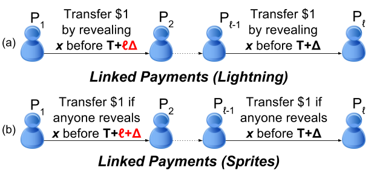

Sprites - Payment Channels that Go Faster than Lightning
=======

Once a payment channel is established between a pair of parties, they can pay each other very rapidly using only off-chain messages (unless one of them crashes, in which case the other can go on-chain to reclaim their balance).

The Lightning Network (and the Raiden Network) also support a "conditional payment" feature that lets one party pay another across a *path* of payment channels, even if they do not have a payment channel directly established between each other. The conditional payment works by reserving a portion of the payment channel's collateral, such that in case of dispute it can be claimed by revealing the preimage of some hash before a deadline.  However, to make sure the payment is atomic and honest parties do not risk losing money, the deadline has to be larger and larger the longer the path.

Sprites are a new kind of payment channel that avoid this problem. They make use of a global contract, the "PreimageManager", which acts like a global condition for all the payment channels on the contract.



This github repo provides a simple implementation of basic bidirectional payment channels (`contractPay.sol`), and an extension that supports conditional payments as described above (`contractSprite.sol`).

Requirements
----
- pyethereum
- solc

These test scripts simply exercise the function of the contract. Coming soon: extended test cases handling linked payments.
 ```
 python test_pay.py
 ```
or
 ```
 python test_sprites.sol
 ```

Contents
-------
- contractPay.sol, test_pay.sol:
   Simple bidirectional payment channel, based on the state channel pattern.

   Some simplifications:
   - while state channels can continue receiving on-chain input, contractDuplex reaches a terminal state after one trigger
   - withdrawals are encoded as monotonically increasing values, so no need to explicitly trigger an outputs

- contractSprite.sol, test_sprite.sol:
   A duplex channel with conditional (hashed timelock) payments, but that supports constant expiry times
 
